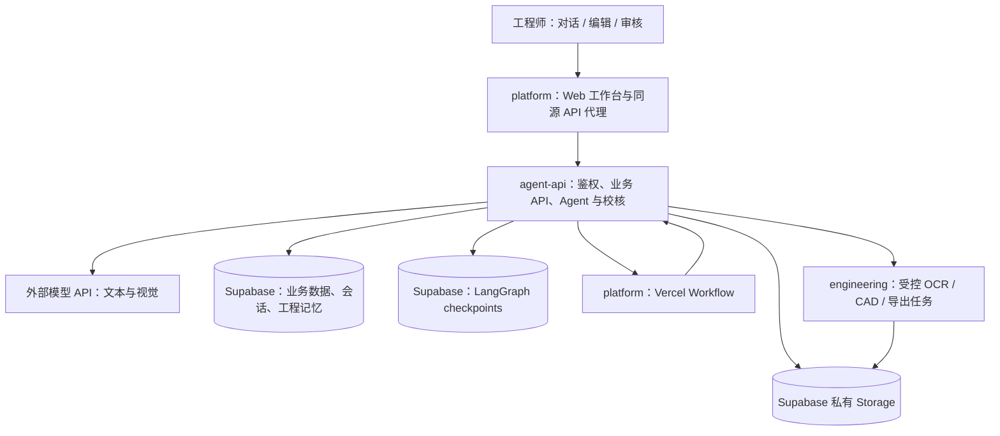

# 工程解析平台 Agent 说明

> 代码核查日期：2026-09-28。本文描述当前仓库实现，取代此前按日期追加的方案说明。当前部署目标为 **Vercel 三项目 + Supabase**；本地运行仍受支持。用户已报告 engineering、agent-api 部署完成，但外部检查被 Vercel 部署保护拦截，本文不将其视为云端业务联调通过。
>
> 本文中的标准编号、模型名称和运行参数是代码配置，不代表已验证标准最新版本、模型供应商能力或部署账户实际限额。完整部署操作见 [Hobby 三项目部署](docs/Hobby三项目部署.md)。文档不包含密钥。

## 1. 系统目标与实现结论

系统面向制造业工程师：装配 PDF → 多级 MBOM → 各对象参考输入 → 制造图 → 核心工艺流程单 → 零件管理。按下级零件、子装配、根装配的依赖顺序处理，每阶段由人审核，上阶段通过后成为下阶段输入。

当前实现采用五类 DeepAgents 实例、工程工具函数、确定性校核、参数化绘图器和持久化工作流协作。Agent 负责解释要求、选择工具和生成候选工程数据；工具负责读取受控数据、计算、检查、导出和保存；用户负责工程审核。

| 能力 | 当前实现 | 必须明确的边界 |
|---|---|---|
| 多级 MBOM | 零部件定义与父子使用关系分离，支持复用与拓扑校验 | 图像识别和工业分层仍依赖模型及人工复核 |
| 对话操作 | 10 个业务工具，可查询、改参数、检索、生成、修改 MBOM | 不允许 Agent 审核、任意执行程序或自由访问数据库 |
| 图纸生成 | tube、plate、rotational 三类几何；PDF/DXF，条件性 DWG | 不是任意零件 Text-to-CAD；复杂箱体/支架不支持自动建模 |
| 工艺生成 | 当前对象交付状态、基准、路线、设备、检验、依据与待复核 | 没有完整切削数据库、热处理专家系统或自动生产认证 |
| 记忆 | 业务会话、图状态 checkpoint、标准引用与历史样例表 | 无 embedding、向量库、自动训练或自动批准知识 |
| 视觉增强 | PDF 文本、按需 CPU OCR、整图/分块/细节图、尺寸证据定位 | OCR 结果不等于正确尺寸；多页视觉存在页数上限 |
| 云端持久化 | Supabase 业务表、私有文件、checkpoint；Vercel Workflow 调度 | 中断恢复有明确边界；尚需真实云端端到端验收 |

## 2. 总体架构与代码目录



| 目录/模块 | 责任 |
|---|---|
| `src/`、`public/` | 工作台、会话、审核、报告弹窗、编辑抽屉、CAD Studio 前端 |
| `server/main.py` | 项目、零件、MBOM、资源、审核、会话及生成 API |
| `server/agent.py` | 五类 Agent、工具注册、专业任务提交、业务流程编排 |
| `server/ai.py` | 模型客户端、装配识别、几何/工艺结构化生成 |
| `server/workflow.py` | 阶段门、下级依赖、祖先失效传播 |
| `server/engineering_skills.py` | 工业能力路由、对象语义、阶段输出契约 |
| `server/evidence.py` | PDF/OCR 证据、视觉切片、字段来源定位 |
| `server/domain.py`、`manufacturing.py`、`engineering_model.py` | 工程归一化、几何/工艺检查、留量计算、中间模型 |
| `server/drawing*.py`、`cad_*.py`、`dwg_converter.py` | 参数化绘图、CAD 编辑、原生导出与转换 |
| `server/cloud_*.py`、`native_*.py` | 云端隔离、持久化、任务续跑、计算服务 RPC |
| `apps/platform/` | Next.js 托管入口、Workflow、代理；`public/` 为已构建前端 |
| `apps/agent-api/` | Python 业务容器；包含根 `server/` 的同步副本 |
| `apps/engineering/` | Python 原生计算容器；OCR、OpenCascade、LibreDWG 等依赖 |
| `supabase/migrations/` | 业务、调度、activity 表与行级权限 |
| `tests/`、`scripts/` | 回归验证、案例评价、部署同步与检查 |

修改后端应编辑根 `server/`，再运行 `python scripts/sync_hobby_projects.py`；前端修改先 `npm run build` 再同步。不要单独修改两个容器中的代码副本。仓库只保留 `apps/` 下的当前三项目部署入口。

## 3. Agent 框架、模型和 Harness

### 3.1 框架依赖

- DeepAgents：`create_deep_agent` 构建工具调用 Agent，requirements 约束 `>=0.7.16,<1`。
- LangChain：消息类型、`@tool` 参数 schema、OpenAI 兼容模型接口；`langchain-openai>=1.6,<2`。
- LangGraph：底层图执行和 checkpoint；本地 SQLite Saver，云端 Postgres Saver。
- OpenAI Python SDK：承担独立的 JSON/视觉生成调用，与 DeepAgents 工具选择调用并存。
- Vercel Workflow：跨请求的任务调度和等待，不承担机械知识推理。

Python 依赖使用版本范围，未全部精确锁版本。下述框架默认中间件按本次本地安装源码核对；升级依赖后应重新核对，不能假定云端安装版本永远一致。

### 3.2 模型配置

| 配置 | 使用位置与默认行为 |
|---|---|
| `DEEPSEEK_API_KEY` | 服务端读取，Agent 与默认生成客户端必需 |
| `DEEPSEEK_BASE_URL` | 默认 `https://api.deepseek.com` |
| `DEEPSEEK_TEXT_MODEL` | 会话/专业 Agent 与无图 JSON 生成；默认 `deepseek-flash` |
| `DEEPSEEK_VISION_MODEL` | 带图 JSON 生成；默认 `deepseek-flash` |
| `ENGINEERING_VISION_BASE_URL`、`ENGINEERING_VISION_API_KEY`、`ENGINEERING_VISION_MODEL` | 配置独立视觉服务时切换带图调用；当前仍先构造默认客户端 |

`_engineering_model()` 使用 `DurableChatOpenAI`，温度 0、超时 95 秒、SDK 重试 0。`completion_json()` 使用 JSON object 响应模式，再 `json.loads` 解析；云端任务单次尝试，本地最多两次。JSON 可解析不代表满足全部工程 schema，后面仍需业务校核。默认 JSON 客户端附带 `thinking.type=disabled`，独立视觉客户端不附带此项。

配置有视觉模型名称，不等于已证明该端点支持 `image_url`；需用真实 PDF 验证图像输入、返回字段及证据正确性。本次文档整理未调用付费模型。

### 3.3 Harness 的实际配置

`_engineering_model()` 注册 `openai:{model_name}` HarnessProfile：

- 排除 `ls/read_file/write_file/edit_file/delete/glob/grep/execute/write_todos`。
- 禁用默认 general-purpose subagent。
- 应用没有传入 `subagents=`、`skills=`、`memory=`、`store=` 或 `interrupt_on=`。
- 应用没有自定义 `backend=`，使用框架默认 StateBackend；它不是工程文件的持久存储。

| Harness 机制 | 当前作用 |
|---|---|
| FilesystemMiddleware | 框架默认栈可能保留该中间件，但通用文件工具已排除 |
| SummarizationMiddleware | 框架上下文压缩；不是企业知识检索或数据库记忆 |
| PatchToolCallsMiddleware | 维护模型工具调用消息的一致性 |
| `_ToolExclusionMiddleware` | 按 profile 移除不允许的工具 |
| 供应商 prompt caching 中间件 | 框架默认可装配；不能据此宣称 DeepSeek 获得对应供应商缓存能力 |
| SubAgentMiddleware / `task` | 未传子 Agent 且默认通用子 Agent 禁用，不通过该工具分派专业任务 |
| SkillsMiddleware / MemoryMiddleware | 未通过框架参数启用；本系统使用 Python 业务路由与数据库记忆 |
| HumanInTheLoopMiddleware | 未启用；人工审核由业务 API、数据库字段和工作流阶段门实现 |

因此，“多个 Agent”具体指应用显式创建和调用多个专业 Agent 实例，不是模型自由创建子 Agent 的群体系统。专业 Agent 以同步嵌套调用为主，没有开放通用 shell、MCP 工具市场或任意 Python 代码执行。

## 4. 五类 Agent 的职责与真实执行方式

| Agent 名称 | 入口 | 工具 | 状态与递归限制 |
|---|---|---|---|
| `engineering-copilot` | `run_chat` | 第 5 节的 10 个业务工具 | 有 checkpoint；递归限制 16 |
| `mbom-engineering-agent` | `refine_mbom` | `inspect_assembly_reference`、`submit_mbom` | 局部提交结果；限制 18 |
| `drawing-engineering-agent` | `_save_part_drawing` | 阶段门、`ai.draft_part`、几何校核、CAD/PDF 导出、原子提交 | 确定性专业流水线；结构化模型生成一次 |
| `process-engineering-agent` | `_save_process` | 阶段门、`ai.draft_process`、工艺校核、PDF/XLSX 导出、原子提交 | 单件/子装配/总装共用的确定性专业流水线 |
| `engineering-workflow-orchestrator` | `run_batch_workflow` | `inspect_workflow_plan`、`execute_next_unlocked_stage` | 单次编排实例；限制 14 |

制图和工艺阶段采用确定性的专业 Agent harness：API 已经确定用户意图和目标对象后，程序按固定顺序执行阶段门检查、专业结构化生成、规则校核、文件导出和原子保存。`ai.draft_part` 与 `ai.draft_process` 仍由模型结合证据和行业契约完成专业规划，但不会再增加一次“让模型决定是否调用唯一提交工具”的冗余模型请求。这避免兼容 OpenAI 接口的模型只回复文字而未发出 tool call，也减少 Vercel Hobby 函数的时间消耗。

生成前置条件、状态门、校核、保存和错误传播全部由 Python 强制执行。模型负责处理存在判断空间的工程语义，程序负责保证每个已授权阶段必然进入执行链，不能以一段文字冒充已生成结果。

## 5. 工程会话：意图识别、工具权限和反馈

### 5.1 意图识别与对象定位

没有另设分类器。会话模型根据用户话语、所选对象、工具说明和项目状态决定查询或操作。`_project_part` 优先匹配 ID、名称或图号，再做名称包含匹配；不唯一或无目标时返回错误，避免把一个零件的修改落到另一个零件。

工具闭包绑定 `project_id` 和 `selected_part_id`，云端再叠加用户作用域和数据库 RLS。用户说“把外径改为某值并重新生成”时，要求先保存参数，再调用生成工具；不能仅用回答文字声称已修改。

### 5.2 10 个业务工具

| 工具 | 输入/输出与副作用 |
|---|---|
| `inspect_project()` | 返回分析、最近 8 条消息、零件、MBOM；截断至 14000 字符 |
| `search_engineering_memory(query)` | 最多 5 个记忆结果，返回来源；截断至 10000 字符 |
| `inspect_current_stage(target)` | 读取完整对象与 workflow 状态、阻断项 |
| `update_part_parameters(patch_json,target)` | 允许名称、图号、材料、geometry 白名单；顶层合并，数组完整替换；不审核、不自动生成 |
| `calculate_machining_allowance(plan_json,target)` | 读取成品尺寸确定性试算，返回制造方案；不保存 |
| `search_similar_part_drawings(target)` | 返回相似候选；不自动选用或审核 |
| `revise_mbom_part(patch_json,target)` | 修改名称、类型、用量、材料、上级等；回到 MBOM 待审核；复用关系移动需用关系表 |
| `generate_part_drawing(target,instruction)` | 调用制图 Agent，校核、导出、保存待审图纸 |
| `generate_part_process(target,instruction)` | 调用工艺 Agent，生成当前零件/子装配工艺 |
| `generate_assembly_process(instruction)` | 明确指向总装时生成总装工艺 |

参数工具不接受审核状态、内部元数据等任意字段。`geometry.user_overrides` 用于保留人工修改，生成提交时重新覆盖候选结果中的同名值。

### 5.3 消息和业务结果

`run_chat` 取最后一轮模型回答，并从生成/参数/MBOM 工具返回中提取事件；最多返回最近 5 个事件。事件携带 output、object_id、object_name、step_count，用于前端刷新和切换结果。`result_summary.generation_summary` 汇总生成核心内容、工程参数和待复核项，工具还返回格式、摘要、工序数等。

当前会话核心调用为 `invoke`，云端通过任务状态等待结果；不能把它描述成完整 token 流式输出系统。字符截断可控制输入规模，也会丢失上下文；它不是语义检索或精确 token 预算。

## 6. 主要调用链路

### 6.1 上传装配图 → MBOM

```text
上传项目文件（含图号）
→ POST /api/projects/{id}/analyze
→ ai.analyze_assembly
→ PDF 文本/OCR/视觉切片 → completion_json → 视觉候选
→ agent.refine_mbom
→ candidates_to_plan + validate_plan 形成基线
→ MBOM Agent 检索参考、提交 parts/links
→ validate_plan 校验 → 保存待审核 MBOM
→ 用户编辑并确认 → 解锁下游
```

`parts` 表示独立定义；`links` 表示 parent、child、每上级 quantity、证据、置信度。根项目不重复创建为下级零件，直接下级 parent 为 null。`mbom.py` 负责拓扑、引用、数量等检查。MBOM Agent 失败或未提交时返回基线候选并附审核未完成说明，不等于人工通过。

### 6.2 制图链路

```text
按钮生成或对话工具
→ _save_part_drawing（确定性制图 Agent harness）
→ 刷新项目与对象快照 → _commit_part_drawing
→ MBOM、直接下级、参考输入门检查
→ ai.draft_part：视觉与工程契约生成 JSON
→ 覆盖人工锁定参数
→ complete_draft_geometry + check_geometry + pending_geometry
→ export_drawing：中间模型、实体检查、PDF/DXF、尝试 DWG
→ 校验 updated_at，失效祖先成果并保存
→ 返回业务摘要、待复核项与实际可用格式
```

先导出再修改业务数据，避免预算切片时过早改变版本。保存使用更新时间检测并发变更，发现对象已更新时拒绝覆盖。制图导出写入独立版本目录；版本目录不等于完整 PLM 版本管理系统。

### 6.3 工艺链路

```text
图纸人工审核通过
→ _save_process（确定性工艺 Agent harness）
→ 刷新项目与对象快照 → _commit_process
→ 校验图纸/下级审核
→ ai.draft_process（按单件、子装配、根装配选择契约）
→ check_process + pending_process
→ PDF / XLSX 导出
→ 并发输入检查、保存待审工艺、返回业务摘要
```

工艺基于本件合格交付状态组织核心路线。上层工艺读取直接下级，不应重复其全部机加工路线。若存在在线编辑的 CAD PDF，生成器读取该图作为当前权威输入，旧参数化 geometry 只供比较。

### 6.4 “启动 Agent 全流程”的实际含义

编排 Agent 读取已保存状态，调用 `_execute_next_workflow_stage`。程序按项目对象顺序寻找下级已完成的对象，执行一个已解锁阶段，然后在人工审核处暂停。

- MBOM 待确认：返回 `waiting_review`，不自动批准。
- 项目待解析：等待解析入口；当前批量函数不会主动调用装配解析。
- 参考未审核：等待用户选图或“无参考图继续”；不自动选用。
- 图纸缺失：调用制图 Agent；已有未审核图纸则等待。
- 图纸已审且工艺缺失：调用工艺 Agent；已有未审工艺则等待。
- 所有直接下级完成：逐级处理上层，最后生成总装工艺。
- 全部批准：业务 job 才标记完成。

`resume_agent_workflow` 在审核后查找最近的“等待审核”job，再次调度。如果未启动批量 job，用户仍可逐步点击生成。计划主要保存在业务状态和依赖图中，没有独立的任意任务规划 DSL 或持久 TODO 列表。基础设施层一个 cloud_task 完成，不等于整个工程项目完成。

## 7. 人工审核与失效传播

| 阶段 | 审核记录 | 下游条件 |
|---|---|---|
| MBOM | 项目 stage 与 analysis 中审核记录 | 阶段必须为已确认/草案待审核/已归档等允许状态 |
| 相似图纸 | `specifications.reference_approval` | 可确认指定参考，也可明确无参考图继续 |
| 生成图纸 | `geometry.approval_status`、`approved_at` | 参考已审、PDF 存在、无 geometry_blockers |
| 工艺流程 | `process.approval_status`、`approved_at` | 图纸已审、有有效 steps 与 PDF |
| 总装工艺 | `analysis.assembly_process` 审核状态 | 直接下级完整通过审核 |

`children_ready` 要求直接下级参考、图纸、工艺全部通过。复用件修改时，`invalidate_dependents` 沿所有父边遍历祖先，撤销相关图纸/工艺审核并清理当前文件链接；拓扑修改将全项目回到 MBOM 审核。文件历史可能仍存在，但不能继续作为当前有效成果消费。

审核 API 对重复批准做幂等处理；图纸和工艺批准时使用更新时间条件避免覆盖并发修改。Agent 没有批准工具。`review_items` 是提示集合，不会全部自动变为阻断：程序的 blocker 检查才决定是否拒绝批准。

“加工余量未知”可以是警告：不得把未确定的毛坯当成确认值，下游保留待复核。几何无效、尺寸链不闭合、证据矛盾、尺寸状态错用、留量方向或计算错误等属于阻断。

## 8. 图像理解与证据增强

### 8.1 PDF、OCR、视觉组合

1. PyMuPDF 读取全部页面文字和词坐标。
2. `needs_ocr`：词数少于 40、替换字符比例超过 2%，或图片面积超过页面 25% 时触发 OCR；`ENGINEERING_OCR=off` 可关闭。
3. RapidOCR/ONNX Runtime 在 CPU 执行；0° 和 90°两次识别，补充竖向标注并映射回 PDF 坐标。保留不同读法，不直接把 OCR 置信度当作工程可信度。
4. 证据包包含文件 SHA256、页码、token ID、原文、bbox、方法、旋转与 OCR 置信度；坐标为 PDF points，左上角原点。
5. 按文件哈希、证据版本和 OCR 模式缓存；有警告的缓存会重试。云端逐页活动可复用已完成结果。
6. 视觉输入包含整页、四个重叠分块、最多三个局部细节；细节优先数字、公差符号、竖向或低置信度区域。

OCR 图最长边上限 2400 像素，视觉切片最长边上限 1800 像素。装配识别默认最多两页图像；单件与装配背景生成通常各取一页。文本证据可包含更多页，并记录 `visual_pages_omitted`。目前没有覆盖所有页的自动视觉扫描或自适应模型选型器。

### 8.2 尺寸证据定位

模型输出 `dimension_evidence`：字段路径 → token_ids、page、raw_text、state。state 区分 stock、part_delivery、post_assembly。关键尺寸缺少定位时，另做一次“只找证据、不修改数值”的模型调用，然后由 `ground_dimensions` 检查引用与读数，保留疑点。

当前参考单件图被选用后，其图片替代装配全图作为主要视觉输入，装配上下文缩减，以减少轴头尺寸污染筒体等跨对象错误。未审核候选 geometry 不作为下一次生成的权威证据；人工锁定字段保留。

这是“引用和数值校验”，不是已解决全部尺寸箭头与实体拓扑关联。相同数字出现于多个位置时仍需核对。缺失证据、冲突、原料与成品状态差异必须显式呈现。

## 9. 工业知识如何进入系统

### 9.1 抽象工业能力路由

`engineering_skills.py` 包含 evidence、mbom、drawing、tolerance、allowance、machining、welding、heat_treatment、assembly、inspection 十类能力描述。

`select_skills` 根据阶段选择基础能力，再根据技术要求、geometry、对象材料和用户输入中的焊接/热处理/公差等词触发补充。`object_semantics` 根据 MBOM 子节点及已有 shape_type 区分根装配、子装配、单件；未确定对象采用 general_part，不按名称强制指定 tube。

`STEP_CONTRACTS` 定义各阶段输出范围：MBOM 只输出定义/关系，drawing 输出可绘制数据，part_process 输出本件制造路线，assembly_process 输出装配路线。它们是代码中的业务提示模板，不是框架加载的 SKILL.md，也不是经过形式化证明的工业推理引擎。

抽象化已用于生产生成主链，但仍有历史案例导入路径、部分关键词规则和有限几何模型。不能声称仓库完全不存在案例特定逻辑。案例验收数值只放测试基线，不应复制进生产提示词作为固定答案。

### 9.2 标准引用与程序绘图规则

`drawing_standard.py` 的总体配置为 ISO 128-1:2020；辅助引用 ISO 128-2/3、ISO 129-1、ISO 5455、ISO 5456-2、ISO 5457、ISO 7200。`memory.py` 另外登记 GB/T 1804-2000、GB/T 1184-1996。

当前保存的是编号、适用范围、来源链接及系统实现规则，没有完整受控标准正文、公差数值表或授权更新服务。因此不能把“引用标准”描述成自动符合所有标准条款，也不能声称程序已默认为所有尺寸生成标准公差。

绘图 profile：A3 420×297 mm；装订边 20 mm，其余边 10 mm；粗细线 0.7/0.35 mm；文字 2.5/3.5/5 mm；箭头 3.5 mm；第一角投影；单位 mm。比例按可用区域从首选系列选择。上述是本系统实现参数。

`dimensional_text` 清理重复名义尺寸和说明，仅接受受限公差/配合表达；复杂表达仍需专门支持。绘图器按几何类型确定视图和剖视，不是完整执行任意 `view_plan` 的通用 CAD 编译器。

## 10. 中间工程模型与确定性校核

### 10.1 数据组织

`build_model` 输出 schema_version=1.0：

| 字段 | 内容 |
|---|---|
| object_id / units / geometry_type | 对象、mm、几何类型 |
| delivery_state | 本件交付状态 |
| dimensions | 路径 ID、数值、公差、来源、reference、verified |
| features / datums | 特征描述和基准 |
| states.stock | 原料尺寸 |
| states.part_delivery | 当前交付尺寸映射 |
| states.post_assembly | 已预留，目前模型构建器为空对象 |
| calculations | 壁厚、各项留量计算 |
| manufacturing_route | 核心路线 |
| validation | policy、errors、warnings、blocked/pending_human_review |

`verified` 当前来自人工覆盖字段判断，不是计量认证或完整审核链证明。数据主要嵌在 geometry JSON 中；工程模型是投影和报告，不是独立的完整特征数据库。导出旁保存 `engineering-model.json`，API `/api/parts/{id}/engineering-model` 提供报告，前端弹窗呈现。

### 10.2 留量计算

成品尺寸保持独立，模型提出 `manufacturing.allowances`，包含 dimension、kind、per_side_mm、faces、basis、reason。程序重算：

```text
外径毛坯 = 成品外径 + 2 × 单边余量
内孔毛坯 = 成品孔径 - 2 × 单边余量
长度/厚度毛坯 = 成品尺寸 + 加工面数 × 单边余量
壁厚 = (外径 - 内径) / 2
```

校验有限非负余量、有效尺寸路径、面数 1/2、径向必须两侧、方向与尺寸类型一致、来源和理由非空、孔径不为负。若来料尺寸已给出，计算值必须一致；偏差超过 0.001 mm 时记录错误。缺少余量条目但有原料/交付尺寸时，按差值推算，轴向默认双端对称并待审。

当前没有按材料/加工设备/批量自动查表的完整余量数据库。模型可提出带理由建议，程序验证算术和边界，工程师确认其工艺适用性。

### 10.3 几何与工艺最低校核

- tube/plate：外径大于内径，长度/厚度有效，tube 内径必须大于零。
- rotational：每段长和直径有效；有总长时段长和误差不得超过 0.05 mm。
- 加工区域不得超出总长；原料/装配后尺寸不能未经确认作为单件交付尺寸。
- 证据检查异常不能静默消失；人工明确参数覆盖后按用户输入处理。
- `check_process` 处理工序结构和工程提示；并非全面工艺仿真、可达性分析或设备能力验证。
- build123d/OpenCascade 检查基础实体有效性、体积与包围盒；只建筒、盘和台阶回转体，不建文字中的所有螺纹、倒角、槽。

核验结果写入报告，不代表所有报告项都强制阻断每个导出入口。例如基础实体核验状态被记录，图纸审核实际使用 `geometry_blockers`；CAD 文档分支主要检查 DXF/PDF 是否存在，尚无通用实体制造性校核。

## 11. CAD 与输出能力

- `drawing_iso.py`：确定性生成 SVG/PDF/DXF；模型提供工程数据，程序安排线型、剖视、尺寸、图框和标题栏。
- `drawing.py`：独立版本目录、工程模型报告、工艺 PDF/XLSX、转换结果与警告。
- `cad_studio.py`：MLightCAD Studio 加载、基线、编辑差异合并和保存；`cad_editor.py` 保留基础编辑接口。
- `cad_import.py` / `cad_artifacts.py`：解析输入、生成预览与导出工件。
- `dwg_converter.py`：DWG 转换适配与结果检查；云端使用 LibreDWG 路径。

CAD 手工修改与参数化 geometry 不是双向约束求解。导入任意 DWG 后，不能保证所有实体都转成可计算的工程特征；工艺生成通过编辑后 PDF 重新读取权威图纸。需要对复杂块、文字、标注和布局进行实际样本验收。

DWG 是条件性输出：转换失败时保留 PDF/DXF 和警告，不把无效文件当成功。开源转换不等于 AutoCAD/ODA 完整兼容；此前实测也不能证明所有 DWG 写入可用。详见 [开源 DWG 替代方案](docs/开源DWG替代方案.md)。没有部署模型任意生成并运行 CAD Python 脚本的能力。

## 12. 记忆、会话和存储

### 12.1 四种持久化职责

| 数据 | 本地 | 云端 | 用途 |
|---|---|---|---|
| projects、parts、mbom_links、resources | SQLite | Supabase engineering schema | 当前工程事实与关系 |
| messages、jobs | SQLite | 同上 | 用户可见会话与业务流程进度 |
| engineering_memory | SQLite | 同上，用户隔离 | 标准引用、历史图、历史工艺 |
| LangGraph checkpoint | `agent_checkpoints.db` | engineering_agent schema | Agent 图状态、消息与待执行节点 |
| cloud_tasks、cloud_activities | 云端专用 | engineering schema | 任务出站记录与成功活动缓存 |
| 图纸、上传和 RPC 文件 | 本地数据目录 | 私有 Storage | 文件成果和计算输入输出 |

### 12.2 会话恢复

本地 thread_id 为 project_id；云端为 owner_id:project_id，处于 task 中再加 :task_id。新线程读取最近 30 条业务消息，每条最多 6000 字符，避免重复当前用户输入。云端同任务续跑发现 pending.next 时 `invoke(None)` 继续，否则送入本轮消息。

专业 Agent 当前没有独立持久 checkpoint；云端依靠外层任务与活动缓存重放其调用。不同任务的专业 Agent 不自动继承上一实例隐状态，必须重新从业务数据库和工具获取事实。

### 12.3 长期知识检索

`memory.seed` 登记标准引用，存在本地样例时导入历史 PDF 元信息和 Excel 工序；样例路径带有早期项目名称。云端镜像不包含用户私有样例，不能假设部署后历史知识自动存在。可通过 `/api/memory` 上传或迁移受控资料。

`retrieve` 按标题完全相等、字符重合和标准类别加分排序；相似图检索由 `/similar-drawings` 聚合候选，最终由人选用。当前无 embedding、向量数据库、重排序模型、反馈微调和知识自动升版。长期记忆不会因为一次错误对话自动变成可靠标准。

## 13. 云端执行、续跑与隔离

### 13.1 三个项目的分工

- platform：Web、同源 API 代理、任务 dispatch/reconcile、Vercel Workflow。
- agent-api：身份验证、业务数据、Agent、规则、任务执行入口；不依赖进程长期常驻保存状态。
- engineering：按白名单执行原生操作。`/health` 返回服务状态；`/execute` 校验服务 token 和用户 UUID。
- Supabase：Auth、Postgres、私有 Storage 和 checkpoint；不是另一个 Agent。

当前云端不需要自建 GPU：OCR 用 CPU，几何/文件处理用 CPU，模型推理由外部 API 提供。浏览器 CAD 可使用用户设备图形能力。若改为自托管视觉/语言模型，GPU 需求应另行评估。

### 13.2 长任务链

```text
用户请求 → cloud_app 识别长操作 → cloud_tasks 入库 → 返回任务 ID / 202
→ platform /api/cloud/dispatch → Workflow 启动
→ agent-api /api/internal/tasks/{id}
→ 用户+项目 advisory lock → cloud_runner 子进程
→ Agent / JSON 模型 / 原生 RPC / 业务保存
→ 成功、失败或主动切片 queued
→ Workflow 等待后续跑 → 前端读取任务结果
```

长路由包含 chat、analyze、单件 drawing/process；批量流程另通过 enqueue_workflow 调度。不是所有 CRUD 或审核请求都自动转换为后台任务。

### 13.3 时间预算和幂等边界

| 位置 | 当前代码值/机制 |
|---|---|
| 模型请求 | 95 秒，无 SDK 自动重试 |
| 原生监督进程 | 100 秒，超时终止子进程 |
| 原生 RPC 客户端 | 115 秒 |
| activity 预算 | 每 slice 210 秒；新非 message 活动前预留 125 秒 |
| 任务监督进程 | 240 秒硬超时 |
| cloud_task 切片 | 最多 40 |
| Workflow 循环 | 最多 120 次；queued 等 1 秒，项目锁忙等 30 秒 |

`activity_call` 用操作名和可移植参数的 SHA256 作键，按 task_id 存储成功结果；文件参数转私有对象引用。已成功活动重放时直接读缓存。模型缓存保留工具调用 ID，提交缓存避免成功生成重复保存，消息缓存避免重复写入。

预算不足抛出 `TaskYield(BaseException)`，越过普通业务异常捕获，由云端入口恢复 queued。该机制是安全边界上的续跑，不是任意指令级断点。进程被硬杀或处于不可判定 running 状态时可能标失败，不盲目重放；数据库提交与活动记录之间也不是分布式 exactly-once 事务。

调度记录保存 workflow_run_id，防止常规重复启动；轮询/补偿重新派发 queued 任务。每日 reconcile 是兜底，不承担实时任务执行。

### 13.4 用户、数据库与文件权限

- `cloud_context` 用 ContextVar 传递 owner 与临时 workspace。
- `cloud_db` 设置 engineering_app 用户上下文，表启用 RLS；连接需支持会话 advisory lock，不能使用事务池模式代替。
- `cloud_app` 验证 Supabase 登录态、Cookie 和写请求 Origin；浏览器使用 platform 同源代理。
- 内部服务使用独立共享 `ENGINEERING_SERVICE_TOKEN`，工程服务验证 owner UUID；不能让客户端自行指定可信 owner。
- Storage 使用私有桶、用户对象前缀和签名上传；完成接口校验票据、目标及大小。每请求临时目录只作处理缓存。
- 原生 RPC 通过 Storage 传输大文件和 JSON，HTTP 传操作名与引用；原生操作为白名单，不接受任意脚本。

以上有对应测试，但不是安全认证；数据库 migration、RLS、环境变量及部署保护需在真实环境配置并验收。

### 13.5 地址与密钥配置关系

| agent-api 中的变量 | 指向 | 作用 |
|---|---|---|
| ENGINEERING_APP_ORIGIN | platform 固定生产根地址 | 浏览器来源校验 |
| ENGINEERING_ORCHESTRATOR_URL | platform 固定生产根地址 | 启动持久任务 |
| ENGINEERING_NATIVE_URL | engineering 固定生产根地址 | OCR/CAD RPC |
| ENGINEERING_ORCHESTRATOR_BYPASS | platform 的自动化绕过密钥 | 如开启 Vercel 部署保护 |
| ENGINEERING_NATIVE_BYPASS | engineering 的自动化绕过密钥 | 如开启 Vercel 部署保护 |

platform 配置 ENGINEERING_BACKEND_URL 指向 agent-api，必要时设置 ENGINEERING_BACKEND_BYPASS。三个项目服务 token 一致；CRON_SECRET 单独设置。Supabase、模型等详细环境变量以部署文档和 `.env.example` 为准；所有密钥只放环境配置，不写入本文或 Git。

## 14. 验收体系与实际验证范围

| 验证层 | 仓库入口 | 能证明什么 |
|---|---|---|
| 工作流/契约 | test_workflow、test_engineering_contracts | 前置门、依赖与数据契约回归 |
| 证据与几何 | test_evidence、test_engineering_model、test_dimension_labels | OCR 坐标、字段依据、基础计算、标注表达 |
| CAD/DWG | test_cad_studio、test_dwg_converter | 保存差异、转换错误和支持范围检查 |
| 云端与恢复 | test_cloud_backend、test_cloud_compute、test_vercel_uploads、test_hobby_deployment | 用户隔离、上传、活动续跑和模拟工具调用 |
| 前端代理 | apps/platform/tests | 代理、Cookie、内部路由与服务鉴权 |
| 案例业务基线 | scripts/evaluate_engineering.py + tests/fixtures/tube_case.json、assembly_case.json | MBOM 层级、辊筒交付尺寸、加工区与总装核心工序命中 |
| 集成试跑 | scripts/benchmark_pipeline.py、scripts/smoke_hobby_workflow.py、scripts/cloud_native_smoke.py | 按脚本范围验证模型链/调度/原生运行依赖 |

案例评价器不被生产生成代码导入；案例答案用来评分，不注入生成提示词。数值命中仍不能替代图面、视图、剖切、标注清晰度、工艺路线和交付状态的工程验收。

本次使用用户提供的收卷轴装配图、7 张历史部件图和工艺卡执行了本地真实模型链路。辊筒识别得到空心筒体边界、φ154/φ125/1554、两端 270 加工区及放量计算，通过图纸门禁后生成并审核了工艺卡；案例评价为 25/25。轴头参考图首次识别漏掉左端 166 mm 轴段，尺寸链门禁按设计阻断，没有自动补造。这证明证据、生成、门禁和人工修正链路有效，不代表所有复杂图纸已可无人审核通过。云端三项目仍需在最新提交部署后复测上传、任务续跑和文件下载。

## 15. 当前缺口与后续优先级

1. **先完成三项目实链验收**：登录、上传、解析、MBOM 审核、参考选择、图纸、工艺、祖先解锁和文件下载；验证超时与续跑。
2. **提升受控知识**：引入有版本和适用范围的公差/企业工艺数据；按证据片段检索，必要时再增加 embedding 与重排序。
3. **扩展工程模型**：由有限形状扩展到孔、槽、螺纹、连接、基准和装配接口的特征级模型；支持审核版本引用。
4. **增强制图校核**：标注完整性、遮挡/碰撞、尺寸链与特征关联、剖视充分性、CAD 手工编辑后与工艺输入的一致性。
5. **完善审计与观测**：每次生成的模型版本、输入证据版本、规则版本、token/费用、工具时间、审核人及差异记录；当前未完整实现。
6. **强化通用性验收**：增加多种零件、多页扫描图、非回转件和复杂装配；既测成功案例，也测证据缺失时是否正确阻断。

这些是待实施方向，不应与当前能力混写。系统专业性由“证据可定位、计算可复核、图纸可表达、流程可审核、变更可追踪”逐步提高，不能仅用更长提示词或堆积技术要求文字替代。

## 16. 维护与相关文档

- 架构与 Agent 当前实现：本文。
- 部署目录、初始化和环境变量：[Hobby 三项目部署](docs/Hobby三项目部署.md)。
- DWG 兼容性与开源替代：[开源 DWG 替代方案](docs/开源DWG替代方案.md)。
- 工程质量、识别链路和外部资源：[工程质量与资源](docs/工程质量与资源.md)。
- CAD 编辑与文件处理：[CAD Studio 集成](docs/CAD-Studio集成.md)和[开源 DWG 替代方案](docs/开源DWG替代方案.md)。

后续改动 Agent 工具、状态门、记忆、模型配置或云端预算时，应同步更新本文对应章节，避免再次用日期追加方式留下互相冲突的架构说明。


## 免账密访问更新

前端 CloudSession 自动调用 `/api/auth/anonymous`，优先恢复已有身份，缺少 Cookie 才创建 Supabase 匿名用户；不再调用密码授权。匿名身份继续使用 owner RLS、私有文件和持久化 Agent 会话，不共享不同浏览器的工程数据。令牌仍仅存 HttpOnly Cookie。

platform 同源代理签署请求来源；`cloud_guard.py` 验证签名和 60 秒时间窗口，并使用 Postgres 原子计数执行 IP 读取/写入/注册/生成限额。`CloudApplication.execute_task` 在项目锁之外获取全站执行槽，默认 2 个。超过槽数返回 409，Workflow 延迟重试；限频返回 429。详见《Hobby三项目部署》免账密章节。
