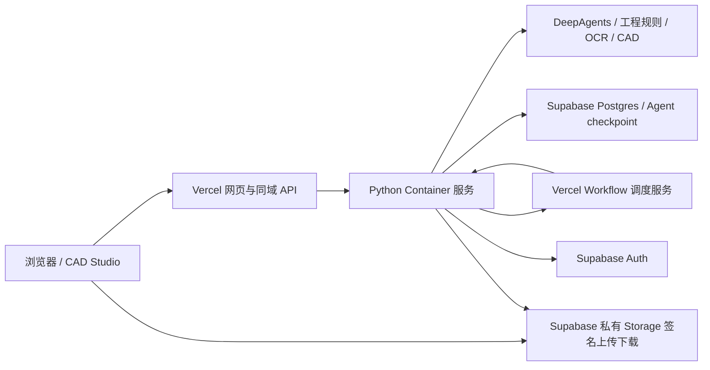

# 历史方案：Vercel Services + Supabase

> 已被 [Hobby 三个独立项目部署](Hobby三项目部署.md) 替代。下方 800 秒、4 GB 与五分钟 Cron 配置不适用于 Hobby，请勿按本文件进行新部署。

更新：2026-09-28。本方案替代此前三平台方案；新部署包不需要 Cloudflare。

## 架构与边界

同一 Vercel 项目包含 web、backend、orchestrator 三个服务。后端工程逻辑集中在 Python 容器；Next.js 服务只负责 Workflow 启动、重试和补投。服务地址通过 bindings 注入，预览部署不会错误调用正式部署。

Vercel Container 仍有函数生命周期限制，不能依靠常驻线程。长请求先写 Postgres outbox，返回任务 ID，再由 Workflow 调用后端。后端单次任务最多 600 秒，容器函数配置 800 秒；项目锁冲突时调度等待，完成任务不会重复执行。人工审核后发起下一阶段。超时终止子进程、保存失败状态和已持久化成果，用户检查后重新发起。尚未把每次模型和工具调用拆成独立 Workflow step，因此不承诺单个 Agent 请求可以无限运行。

业务数据采用 engineering schema 和强制 RLS，Agent checkpoint 使用 engineering_agent schema，按用户 UUID / 项目隔离。每次请求使用临时目录，文件持久化为 Storage 对象引用。当前隔离单位是用户；企业多人共享权限需要另行设计。

上传采用「申请签名 → 浏览器直传私有桶 → 后端校验并导入」，单文件上限 30 MB。下载经鉴权后跳转短期签名 URL，避免大文件经过函数响应。incoming 临时对象需配置定期清理策略。CAD 编辑会话已保存的文件会写入 Storage。

## 请申请的资源

| 资源 | 要求 | 用途 |
| --- | --- | --- |
| Vercel 项目 | Pro 起；账号可用 Services、Container Images、Workflow、Cron | 同一项目承载三个服务 |
| Python Container | Linux，配置 4 GB 内存、800 秒函数时限；实际以账户开放能力为准 | DeepAgents、CPU OCR、工程计算、PDF/DXF |
| Workflow | 开通并允许部署生成的 Workflow 路由 | 持久调度、冲突等待、失败重试 |
| Supabase 项目 | Postgres、Auth、私有 Storage；正式环境建议付费并启用备份 | 数据、会话、用户与文件 |
| 数据库连接 | 直连或 5432 Session pooler，sslmode=require；不能用 6543 Transaction pooler | 会话锁和 RLS 上下文 |
| DeepSeek | 现有 API 配置与可用余额 | 文本/视觉模型调用 |
| LibreDWG | 已在容器构建中集成开源源码，不需另购 ODA | DWG 导入；写出受回读门禁限制 |

服务地区尽量靠近 Supabase 数据库。无需单独购买服务器或 GPU。请先确认 Vercel 账号已开放容器与 Services 能力，再确定套餐；普通 Python Functions 不能直接替代该容器配置。

## 环境变量

模板：deploy/vercel-platform/env.example。只在 Vercel 服务端设置密钥，不写入网页源码。

- SUPABASE_URL、SUPABASE_PUBLISHABLE_KEY、SUPABASE_SECRET_KEY、SUPABASE_DB_URL。
- ENGINEERING_APP_ORIGIN：最终 HTTPS 站点域名，必须与浏览器 Origin 一致。
- ENGINEERING_SERVICE_TOKEN、CRON_SECRET：两个独立的密码学随机值，各至少 32 字符。
- DEEPSEEK_API_KEY、模型名及地址；可选独立视觉模型配置沿用现有实现。
- ENGINEERING_RUNTIME=cloud、ENGINEERING_TASK_PROVIDER=vercel。
- ENGINEERING_BACKEND_URL、ENGINEERING_ORCHESTRATOR_URL 由 bindings 自动提供，不手写。

不要把密钥发到公开文档；可以直接在平台环境变量界面配置。Preview 与 Production 使用不同 Supabase 项目或至少不同数据环境，并分别配置 Origin。

## 部署步骤

1. Supabase Auth 创建测试用户；关闭不需要的公开注册。
2. 在仓库根目录执行 supabase link，随后 supabase db push --dry-run 检查迁移，再执行 supabase db push。包含业务表及 20260928020000_vercel_task_dispatch.sql。
3. 安装 requirements-cloud.txt，设置管理员 SUPABASE_DB_URL，运行 `python scripts/setup_cloud_checkpoints.py`，仅初始化一次 checkpoint 表与策略。
4. 执行 `npm run build`，再执行 `python scripts/package_vercel_platform.py`。输出 .cloud-build/vercel-时间 目录，内含完整 Services 配置、网页、Python Dockerfile 和 Workflow 工程。不会复制本地 .env、数据库或业务样例。
5. 在输出目录关联 Vercel 项目并部署，设置上述环境变量。安装 Workflow 的依赖并执行构建由 Vercel 完成。容器构建执行 cloud_native_smoke.py 校验 OCR/CAD 原生库。
6. 设置最终域名与 ENGINEERING_APP_ORIGIN 后重新部署。Cron 每 5 分钟补投 queued 任务；内部接口另有服务令牌鉴权。
7. 依次验证登录、PDF 直传、MBOM、人工审核、图纸、工艺、归档、文件下载、CAD 保存、刷新恢复；用第二个用户验证数据与文件隔离。

项目内 deploy/cloudflare-platform 为历史实现，新打包器不复制也不依赖它。

## 旧数据迁移

先备份本地数据库和文件。执行 `python scripts/migrate_cloud_data.py --owner SUPABASE_USER_UUID` 只读预检，核对后增加 --apply。脚本不删除源数据、不覆盖已有同 ID 记录。业务消息、记忆及引用文件迁移；旧 SQLite 的未完成工具 checkpoint 不重放，云端从业务消息恢复上下文。

## 原生依赖和验收范围

Python 容器安装 RapidOCR/ONNX、build123d/OpenCascade、PDF/DXF 库、中文字体及 LibreDWG 0.14。已替换 ODA 依赖；当前样例 DWG 导入通过，写出发现兼容性问题并由门禁拦截。不可承诺完整 DWG 写出兼容性，详见 [开源替代与实测](开源DWG替代方案.md)。

本地代码测试和前端构建不等于云端部署验收。目前没有真实账号资源，本机也没有 Docker，Linux 镜像、Vercel Services 与 Workflow 联调、Supabase 实际迁移、真实模型长任务和并发容量仍须在资源开通后验证。

本次验证：56 项 Python 测试通过；前端与 Next Workflow 生产构建通过；2 项调度服务测试通过；PGlite 执行业务与新增调度字段迁移，验证用户隔离和跨项目外键；本地 HTTP 提交 → Workflow → 鉴权后端步骤联调通过（使用后端桩，不调用真实模型或数据库）。部署包已检查未包含 .env、本地数据库、node_modules 或 Cloudflare 工程。

## 官方依据

- [Vercel Services 配置](https://vercel.com/docs/services/config-reference)
- [Service bindings](https://vercel.com/docs/services/bindings)
- [Container Images](https://vercel.com/docs/functions/container-images)
- [函数限制](https://vercel.com/docs/functions/limitations)
- [Vercel Workflows](https://vercel.com/docs/workflows)
- [Supabase 签名上传](https://supabase.com/docs/reference/python/storage-from-createsigneduploadurl)
